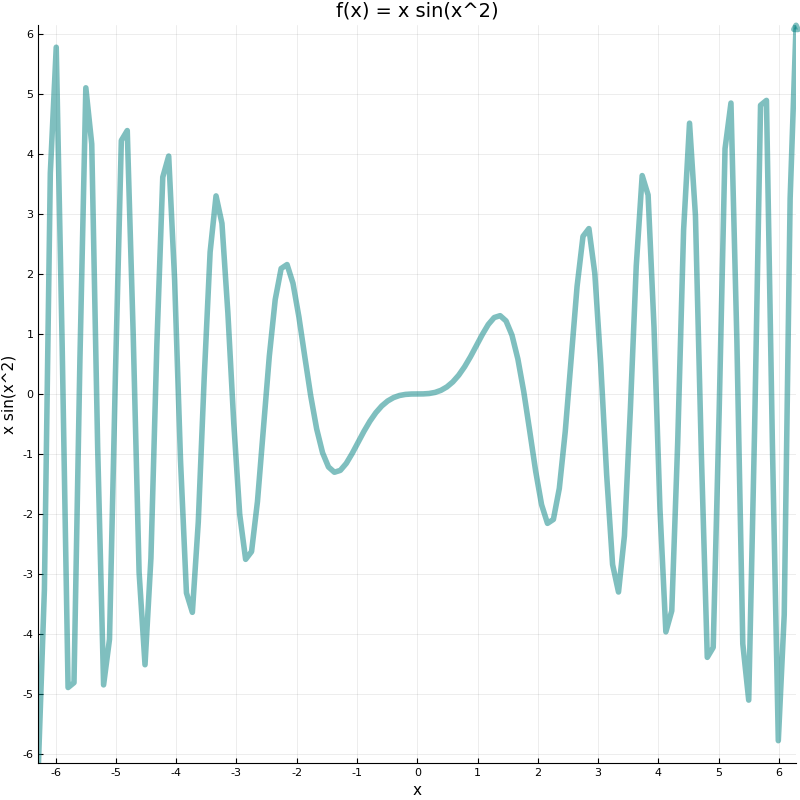
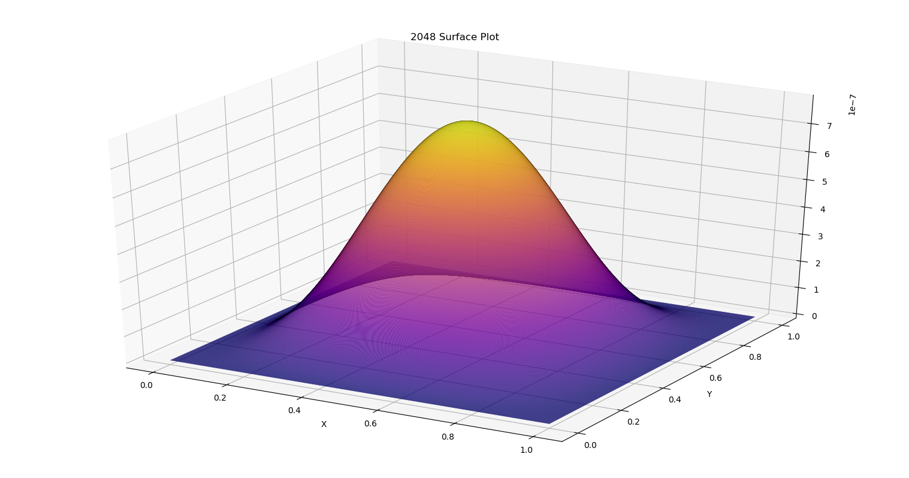

_Σύγκριση Julia Matlab (Sharma Paper)_

# Βασικές Λειτουργίες

Στο κεφάλαιο αυτό, θα εξετάσουμε ορισμένες πολύ βασικές λειτουργίες, που αφορούν την εφαρμογή της γραμμικής άλγεβρας. Τα ακόλουθα παραδείγματα, έχουν αναπτυχθεί από το Center for Interdisciplinary Research and Consulting (CIRC) για τη Matlab. Στόχος είναι να εξεταστεί η ευκολία εκτέλεσης των αντίστοιχων λειτουργιών στο περιβάλλον Julia. Θα εξεταστούν η επίλυση γραμμικού συστήματος, η εύρεση ιδιοτιμών καθώς και η σχεδίαση γραφημάτων, μιας και είναι ευρέως χρησιμοποιούμενα εργαλεία σε διδακτικό αλλά και ερευνητικό περιβάλλον.

## Επίλυση γραμμικού συστήματος

Με είσοδο αυτό το απλό γραμμικό σύστημα:

−x<sub>2</sub> + x<sub>3</sub> = 3

x<sub>1</sub> − x<sub>2</sub> − x<sub>3</sub> = 0

−x<sub>1</sub> − x<sub>3</sub> = −3

Αν αναπαραστήσουμε τους συντελεστές των αγνώστων ως μητρώο και το δεξί μέλος ως διάνυσμα, παίρνουμε το ακόλουθο σύστημα, γραμμένο σε Julia:

```julia
A = [0 -1 1; 1 -1 -1; -1 0 -1]
b = [3;0;-3]

x = A\b
```

Η λύση είναι η αναμενόμενη:
```julia
Float64[3]
1.00
-1.00
2.00
```

Παρατηρούμε ότι η επίλυση, χρησιμοποιεί τον τελεστή της ανάποδης καθέτου `\`, ο οποίος συμπεριφέρεται όπως και στο περιβάλλον Matlab.

## Υπολογισμός ιδιοτιμών και ιδιοδιανυσμάτων

Η συνάρτηση `eig()`  υπολογίζει τις ιδιοτιμές και τα ιδιοδιανύσματα ενός μητρώου, ακριβώς όπως και στη Matlab:


```julia
A = [1 -1; 1 1]
eigenvalues, eigenvectors = eig(A)
```

Η λύση είναι ίδια με τα θεωρητικά αποτελέσματα:
```julia
eigenvalues

Complex{Float64}[2]
1.00 + 1.00im
1.00 - 1.00im

eigenvectors


2×2 Array{Complex{Float64},2}:
 0.707107+0.0im       0.707107-0.0im     
      0.0-0.707107im       0.0+0.707107im
```

Μπορούμε να αποδείξουμε την ορθότητα, ανακατασκευάζοντας το αρχικό μητρώο με τον ακόλουθο υπολογισμό:


Όπου $$Ε$$ το μητρώο των ιδιοδιανυσμάτων και $$D$$ το διαγώνιο μητρώο των ιδιοτιμών (όπως εξηγείται παρακάτω).

Ο οποίος εκφράζεται στη Julia ως:

```julia
EigenvalueMatrix = [eigenvalues[1] 0; 0 eigenvalues[0]]
reconstructedMatrix = eigenvectors * EigenvalueMatrix *inv(eigenvectors)
```

Ο παραπάνω υπολογισμός, χρησιμοποιεί το μητρώο `EigenvalueMatrix` (αντίστοιχο του $D$ στον προαναφερθή τύπο) το οποίο αποτελείται από ένα τετραγωνικό διαγώνιο μητρώο, με τις τιμές της διαγωνίου, να είναι οι ιδιοτιμές του αρχικού μητρώου.

Η συνάρτηση `inv()` επιστρέφει τον αντίστροφο ενός μητρώου.

Το αποτέλεσμα, είναι ένα μητρώο με μιγαδικές τιμές, μιας και τα διανύσματα που χρησιμοποιήσαμε ήταν μιγαδικά.
Ωστόσο, το αποτέλεσμα είναι σωστό, μιας και τα φανταστικά μέρη είναι μηδενικά, και τα πραγματικά μέρη είναι αυτά του αρχικού μητρώου.

```julia
reconstructedMatrix

2×2 Array{Complex{Float64},2}:
 1.0+0.0im  -1.0+0.0im
 1.0+0.0im   1.0+0.0im
```

## Δισδιάστατα Γραφήματα

Ίσως ο πιο διαδεδομένος τρόπος παρουσίασης αποτελεσμάτων οποιασδήποτε μέτρησης, είναι τα γραφήματα. Κατά συνέπεια, η ευρύτατη και συχνή χρήση τους, δημιουργεί την ανάγκη υποστήριξης από το περιβάλλον ανάπτυξης, με τρόπο εύχρηστο και εύληπτο. Ταυτόχρονα, λόγω της τεράστιας διακύμανσης στις πληροφορίες που αναπαριστούν, και τα διάφορα είδη τους, πρέπει η διεπαφή των γραφημάτων, να είναι ευέλικτη και αρκετά παραμετροποιήσιμη.

Στην Julia, μέχρι και την έκδοση 0.6.x δεν υπάρχει ενσωματωμένη υλοποίηση βιβλιοθήκης σχεδίασης γραφημάτων. Ωστόσο, μια πολύ καλή λύση, είναι το πακέτο `Plots`, το οποίο παρέχει μια διεπαφή με διάφορες βιβλιοθήκες/πακέτα που καλούν μηχανές γραφικών (rendering engines) σε τρίτες γλώσσες (όπως Python), αλλά και στην ίδια τη Julia (πχ `Gadfly`, παρόμοιο με το πακέτο `ggplot2` της R). Αυτό δίνει τη δυνατότητα, σε ένα χρήστη εξοικειωμένο με τις δυνατότητες και παραμέτρους εγκαθιδρυμένων εργαλείων/βιβλιοθηκών στον επιστημονικό χώρο και την παρουσίαση δεδομένων, να έχει ένα πολύ χαμηλότερο κόστος εκμάθησης. Για παράδειγμα, οι βιβλιοθήκες `Matplotlib` και `PyPlot` είναι οι πιο διαδεδομένοι τρόποι σχεδίασης γραφημάτων στην Python, και υποστηρίζονται τόσο με δικές τους βιβλιοθήκες-wrappers όσο και μέσω της γενικότερης διεπαφής που παρέχεται από την `Plots`.

Είναι δυνατό λοιπόν, να χρησιμοποιήσουμε σχεδόν απ' ευθείας βιβλιοθήκες τρίτων γλωσσών στη Julia. Ωστσο, αυτή η προσέγγιση έχει και αρκετά μειονεκτήματα. Τα αντίστοιχα πακέτα (πχ το `PyCall` και `PyPlot`) απαιτούν περιβάλλον Python, καθώς και το Nokia Qt για τη σχεδίαση παραθύρων ανεξαρτήτως πλατφόρμας. Αυτά, αν και δεν απαιτούν κάποιο άλλο βήμα εγκατάστασης (έρχονται μαζί με τα πακέτα ως προαπαιτούμενα), μπορεί να μην έχουν την ίδια συμπεριφορά ανάλογα το σύστημα και τις ρυθμίσεις των μεταβλητών περιβάλλοντός του, που μπορεί να εγκυμονεί αναπάντεχες περιπλοκές μετά την εγκατάσταση.

Ένα άλλο μειονέκτημα, είναι πως οι κλήσεις στις βιβλιοθήκες αυτές, δεν είναι εντελώς ίδιες με τη χρήση τους στην γλώσσα προέλευσής τους, κάτι που μπορεί εύκολα να οδηγήσει σε σύγχυση κάποιον έμπειρο χρήστη τους.

Τέλος, ο τρόπος αυτός, δεν είναι ιδανικός, μιας και δεν είναι πραγματικά ανεξάρτητος πλατφόρμας εκτέλεσης και στηρίζεται σε εξωτερικά εκτελέσιμα (που μπορεί να μην είναι συμβατά ή να μη λειτουργούν το ίδιο σε διαφορετικά συστήματα).

Παραταύτα, η αφαίρεση πάνω απ' την υλοποίηση που παρέχει η `Plots`, λύνει όλα αυτά τα προβλήματα, καθώς προσφέρει ένα κανονικοποιημένο τρόπο σχεδίασης/συντακτικού στα γραφήματα, κάτι που διευκολύνει το διαμοιρασμό/συνεργασία, ακόμα και μεταξύ διαφορετικών υλοποιήσεων της πραγματικής βιβλιοθήκης γραφημάτων.

Για τις ανάγκες των γραφημάτων που θα παρουσιαστούν, θα χρησιμοποιήσουμε κλήσεις στην `Plots` η οποία καλεί αυτόματα το επιλεγμένο "backend". Για το ρόλο αυτό, επιλέχθηκε η `PyPlot` ως βιβλιοθήκη υλοποίησης των γραφημάτων, μιας και πληρεί τα εξής κριτήρια:

* Μπορεί να σχεδιάσει κάθε είδος γραφήματος που χρειαζόμαστε
* Τα παραγόμενα γραφήματα είναι σε επαρκές μορφές εξόδου (οθόνη/αρχεία)


Εγκαθιστώντας τα κατάλληλα πακέτα:

``` julia
Pkg.add("Plots")
Pkg.add("PyPlot")
```

μπορούμε να τρέξουμε τις ακόλουθες εντολές, για να σχεδιάσουμε ένα γράφημα της συνάρτησης f(x) = x sin(x<sup>2</sup>):

``` julia
using Plots
filepath = "matlabdata.dat"
A = readdlm(filepath) # read a file with data in a known matrix format
x = A[:,1]
y = A[:,2]
display(
  plot(
    x,
    y,
    size=(800,800),
    ticks=[n for n=-6:6], #display axis ticks and grid lines
    line = (:line,:solid, :arrow, 0.5, 4, :teal),
    xlabel = "x",
    ylabel = "x sin(x^2)",
    title="f(x) = x sin(x^2)",
    lw=3
    )
 ) # display() is necessary if used inside a script,
   # due default configuration of only the REPL
   # displaying output, even plots
png("matlabdata") # save the plot to a .png file
```

Και το αποτέλεσμα:



## Δοκιμή Σύνθετων Λειτουργιών

Θα επιχειρίσουμε να λύσουμε το πρόβλημα της αριθμητικής επίλυσης με πεπερασμένες διαφορές, για την εξίσωση Poisson με ομοιογενή όρια Dirichlet [1, 3, 4, 8]

Το πρόβλημα μπορεί να αναχθεί σε ένα πρόβλημα γραμμικών εξισώσεων που επιλύονται με τον ακόλουθο τρόπο:

``` julia
using PyPlot

function setupA(N)
    I = speye(N)
    s = vcat(squeeze(-1*ones(Int64,1,N-1),1),
            squeeze(2*ones(Int64,1,N),1),
            squeeze(-1*ones(Int64,1,N-1),1))
    i = vcat([n for n=2:N],[n for n=1:N],[n for n=1:N-1])
    j = vcat([n for n=1:N-1],[n for n=1:N],[n for n=2:N])
    T = sparse(i,j,s)
    return kron(I,T) + kron(T,I)
end

ndgrid(v::AbstractVector) = copy(v)

function ndgrid(v1::AbstractVector{T}, v2::AbstractVector{T}) where T
    m, n = length(v1), length(v2)
    v1 = reshape(v1, m, 1)
    v2 = reshape(v2, 1, n)
    (repmat(v1, 1, n), repmat(v2, m, 1))
end

function ndgrid_fill(a, v, s, snext)
    for j = 1:length(a)
        a[j] = v[div(rem(j-1, snext), s)+1]
    end
end

function ndgrid(vs::AbstractVector{T}...) where T
    n = length(vs)
    sz = map(length, vs)
    out = ntuple(i->Array{T}(sz), n)
    s = 1
    for i=1:n
        a = out[i]::Array
        v = vs[i]
        snext = s*size(a,i)
        ndgrid_fill(a, v, s, snext)
        s = snext
    end
    out
end

function driver_ge(N)
    h = 1 / (N+1);
    x = [h : h : 1-h;]
    y = x;
    X, Y = ndgrid(x,y)
    F = (-2*pi^2) * (cos.(2*pi*X).*(sin.(pi*Y)).^2 + (sin.(pi*X)).^2.*cos.(2*pi*Y))
    b = h^2 * F[:]
    X, Y , E = calculation(N,b,x ,y)

    fig = figure("pyplot_surfaceplot",figsize=(20,10))
    ax = fig[:add_subplot](1,1,1, projection = "3d")
    ax[:plot_surface](X, Y, E, rstride=2,edgecolors="k", cstride=2,
                      cmap=ColorMap("plasma"), linewidth=0.01)
    xlabel("X")
    ylabel("Y")
    title(string(N," Surface Plot"))
    io = open(string("meshPlot_",N,".png"),"w");
    show(io, "image/png", fig)
    close(io)
end


function calculation(N, b, x, y)
    A = setupA(N)
    u = A \ b
    Uint = reshape(u, (N,N)) # N.B.: Uint has only solutions on interior points
    x = vcat([0], x, [1])
    y = vcat([0], y, [1])
    X, Y = ndgrid(x,y)
    U = zeros(size(X))
    U[2:end-1,2:end-1] = Uint
    Utrue = (sin.(pi*X)).^2 .* (sin.(pi*Y)).^2
    E = U - Utrue
    return X, Y, E
end
```

Για τιμές N = { 32, 64, 128, 256, 512, 1024, 2048 }


